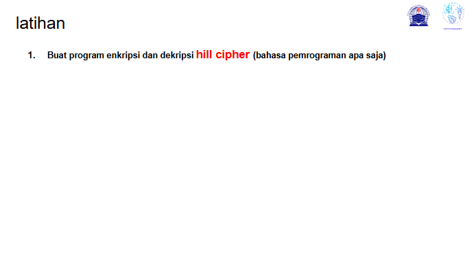
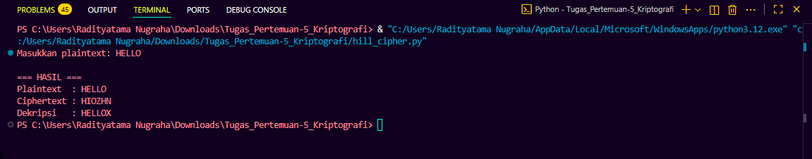
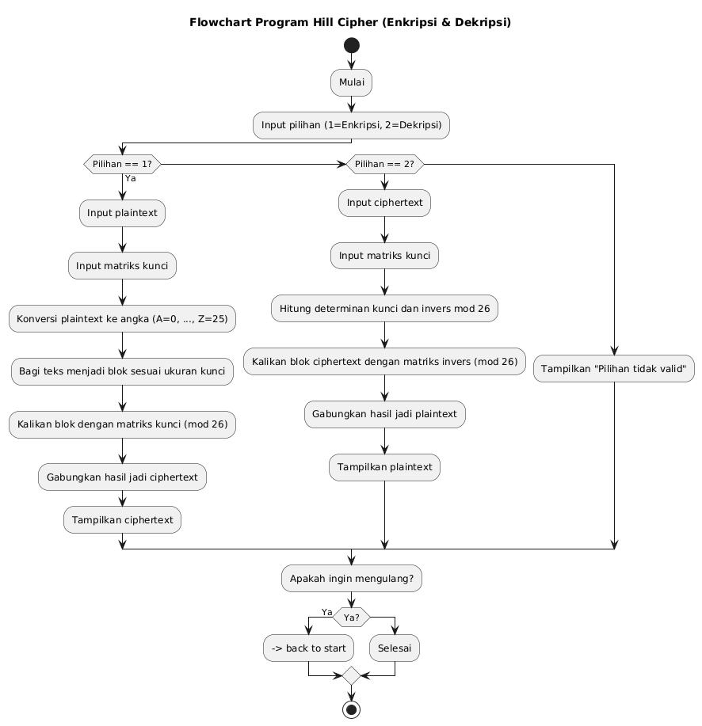

# Tugas Pertemuan 5 

|Nama|NIM|Kelas|Mata Kuliah|
|----|---|-----|------|
|**Radityatama Nugraha**|**312310644**|**TI.23.A3**|**Kriptografi**|

# Soal :



## Code Program :
```python
import numpy as np

def text_to_numbers(text):
    return [ord(c) - ord('A') for c in text.upper().replace(" ", "")]

def numbers_to_text(numbers):
    return ''.join(chr(int(n) + ord('A')) for n in numbers)

def hill_encrypt(plaintext, key_matrix):
    n = key_matrix.shape[0]
    plaintext_numbers = text_to_numbers(plaintext)
   
    while len(plaintext_numbers) % n != 0:
        plaintext_numbers.append(ord('X') - ord('A'))
    
    ciphertext = []
    for i in range(0, len(plaintext_numbers), n):
        block = np.array(plaintext_numbers[i:i+n])
        enc_block = np.dot(key_matrix, block) % 26
        ciphertext.extend(enc_block)
    
    return numbers_to_text(ciphertext)

def hill_decrypt(ciphertext, key_matrix):
    n = key_matrix.shape[0]
    cipher_numbers = text_to_numbers(ciphertext)
    
    det = int(round(np.linalg.det(key_matrix))) % 26
    det_inv = pow(det, -1, 26)  

    key_matrix_inv = (
        det_inv * np.round(det * np.linalg.inv(key_matrix)).astype(int)
    ) % 26

    plaintext = []
    for i in range(0, len(cipher_numbers), n):
        block = np.array(cipher_numbers[i:i+n])
        dec_block = np.dot(key_matrix_inv, block) % 26
        plaintext.extend(dec_block)
    
    return numbers_to_text(plaintext)

if __name__ == "__main__":
    key_matrix = np.array([[3, 3],
                           [2, 5]])  
    plaintext = input("Masukkan plaintext: ").upper()

    ciphertext = hill_encrypt(plaintext, key_matrix)
    decrypted = hill_decrypt(ciphertext, key_matrix)

    print("\n=== HASIL ===")
    print("Plaintext  :", plaintext)
    print("Ciphertext :", ciphertext)
    print("Dekripsi   :", decrypted)
```

## Output :



## Flowchart Hill Cipher:



## Pseudocode :
```
ALGORITMA HILL_CIPHER
INPUT: plaintext (teks huruf A–Z)
OUTPUT: ciphertext (hasil enkripsi), plaintext_decrypted (hasil dekripsi)

FUNGSI text_to_numbers(teks):
    UBAH teks menjadi huruf besar
    HAPUS semua spasi
    KONVERSI setiap huruf menjadi angka dengan rumus:
        angka = ASCII(huruf) - ASCII('A')
    KEMBALIKAN daftar angka

FUNGSI numbers_to_text(daftar_angka):
    KONVERSI setiap angka menjadi huruf dengan rumus:
        huruf = CHAR(angka + ASCII('A'))
    GABUNG semua huruf menjadi satu string
    KEMBALIKAN string hasil

FUNGSI hill_encrypt(plaintext, key_matrix):
    n ← ukuran baris key_matrix
    plaintext_numbers ← text_to_numbers(plaintext)

    SELAMA panjang(plaintext_numbers) MOD n ≠ 0:
        TAMBAHKAN nilai ('X' - 'A') ke plaintext_numbers

    ciphertext ← list kosong
    UNTUK i dari 0 hingga panjang(plaintext_numbers) - 1 dengan langkah n:
        block ← ambil n elemen dari plaintext_numbers mulai i
        enc_block ← (key_matrix × block) MOD 26
        TAMBAHKAN enc_block ke ciphertext

    ciphertext_text ← numbers_to_text(ciphertext)
    KEMBALIKAN ciphertext_text

FUNGSI hill_decrypt(ciphertext, key_matrix):
    n ← ukuran baris key_matrix
    cipher_numbers ← text_to_numbers(ciphertext)

    det ← determinan(key_matrix) dibulatkan ke integer MOD 26
    det_inv ← invers_multiplikatif(det, 26)

    key_matrix_inv ← (det_inv × (det × invers_matriks(key_matrix))) MOD 26

    plaintext ← list kosong
    UNTUK i dari 0 hingga panjang(cipher_numbers) - 1 dengan langkah n:
        block ← ambil n elemen dari cipher_numbers mulai i
        dec_block ← (key_matrix_inv × block) MOD 26
        TAMBAHKAN dec_block ke plaintext

    plaintext_text ← numbers_to_text(plaintext)
    KEMBALIKAN plaintext_text

PROGRAM UTAMA:
    key_matrix ← [[3, 3],
                  [2, 5]]
    CETAK "Masukkan plaintext: "
    plaintext ← input pengguna dan ubah ke huruf besar

    ciphertext ← hill_encrypt(plaintext, key_matrix)
    decrypted ← hill_decrypt(ciphertext, key_matrix)

    CETAK "=== HASIL ==="
    CETAK "Plaintext  :", plaintext
    CETAK "Ciphertext :", ciphertext
    CETAK "Dekripsi   :", decrypted
```
